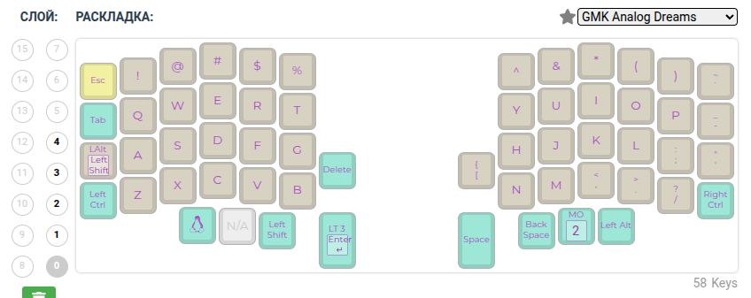
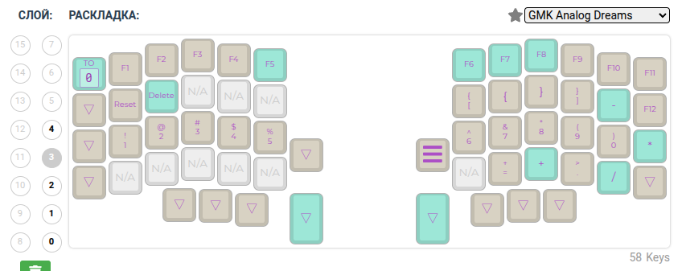

# Слои






# Сборка vial для Lily58

## Подготовка

```bash
git clone --recurse-submodules -j8 https://github.com/vial-kb/vial-qmk
cd vial-qmk
```

```bash
python3 -m venv venv
python3 -m pip install qmk
qmk setup
```

```bash
cd keyboards/lily58/rev1/
rm -rf keymaps
git clone git@github.com:Feelinglight/qmk_lily58_keymaps.git keymaps
```

## Изменение раскладки

Раскладка меняется через [Web UI](https://config.qmk.fm/#/lily58/rev1/LAYOUT)

В конфигуратор загружается файл **./lily58_rev1.json**, меняется раскладка и загружается
измененная json-конфигурация.

Для генерации c-файла выполнить ``make json2c``


## Прошивка

Левая половинка:

- Подключить type-c к левой половинке
- Выполнить ``make flash_left``
- Нажать RESET

Правая половинка:

- Подключить type-c к правой половинке
- Выполнить ``make flash_right``
- Нажать RESET


